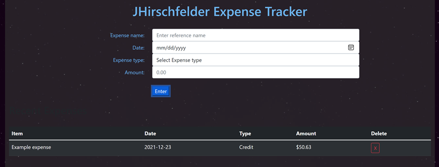

# Expense tracker app 

An expense tracker build with React js and Bootstrap. 
  
View it [here](https://jhirschfelder-expensetracker.herokuapp.com/)

This was my first app built with React js and bootstrap. It takes user input and saves to state, then passing that data as a prop to a render function. This project provided a fun challenge and learning experience for exploring React. I like the modularity and reuseable components and look forward to working more in this library. 

